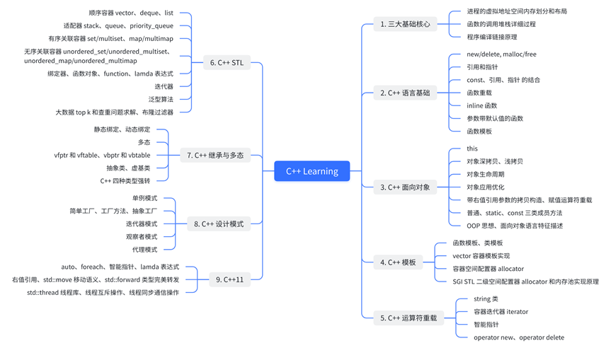

# CppLearning

VSCode WSL2 环境调试运行学习 C++ 代码

> 视 C++ 为一个语言联邦：
>
> + C
> + 面向对象
> + 模板编程，C++ 泛型编程的部分
> + STL: 容器、迭代器、算法、函数对象

## 基础核心

### [进程的虚拟地址空间内存划分和布局](./docs/核心1_进程的虚拟地址空间.md)

### [函数的调用堆栈详细过程](./docs/核心2_函数调用堆栈过程.md)

### [程序编译链接原理](./docs/核心3_程序编译链接原理.md)

## [C++基础](./docs/C++ 语言基础.md)

### 形参带默认值函数 

### inline 函数

### 函数重载

### const

### new 和 delete

## [C++面向对象——基础](./docs/C++ 面向对象_基础.md)

### OOP、this 指针

### OOP 实现顺序栈

### 构造函数和析构函数

### 对象深拷贝和浅拷贝

### 构造函数的初始化列表

### 普通、static、const 三类成员方法

### 指向类成员 (成员变量、成员方法) 的指针

## [C++面向对象——运算符重载](./docs/C++ 面向对象_运算符重载.md)

### Complex 类

### string 类

### string 类的容器迭代器

### vector 容器的迭代器实现

### 迭代器的失效

## [C++面向对象——继承与多态](./docs/C++ 面向对象_继承与多态.md)

### 继承的本质、原理

### 派生类的构造过程

### 重载、隐藏、覆盖

### 虚函数、静态绑定、动态绑定 (多态、vfptr 和 vftable)

### 虚析构函数

### 虚函数和动态绑定

### 多态

### 继承、多态常见笔试面试题

### C++ 多重继承

## [C++模板编程](./docs/C++ 模板编程.md)

### 函数模板

### 类模板

### vector 容器模板实现

### 容器空间配置器 allocator

## [C++STL](./docs/C++ STL.md)

### 简介

### 顺序容器对比：vector、deque、list

### 容器适配器

### 关联容器：无序、有序

### 迭代器

### 函数对象

### 泛型算法和绑定器

## C++高级进阶

### [C++对象优化](./docs/C++ 面向对象_对象优化.md)

### [C++右值引用](./docs/右值引用.md)

### [C++智能指针](./docs/C++11 智能指针.md)

### [C++强弱智能指针应用实例](./docs/C++11 强弱智能指针应用实例.md)

### [C++语言级别多线程编程](./docs/C++ 语言级别多线程编程.md)

## C++11 特性

### auto

### foreach

### 智能指针

### lamda 表达式

### 右值引用

### std::move 移动语义

### std::forward 类型完美转发

### std::thread 线程库

### 线程互斥操作

### 线程同步通信操作

## [设计模式](./docs/设计模式.md)

### 单例模式

### 简单工厂

### 工厂方法

### 抽象工厂

### 代理模式

### 装饰器模式

### 适配器模式

### 观察者模式
