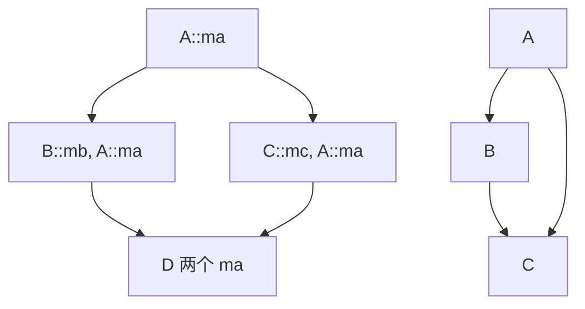

# C++ 继承与多态

## 继承的本质、原理

+ 继承的本质 (继承的好处是什么) ：
  + 代码的复用
  + 在基类中给所有派生类提供统一的虚函数接口, 让派生类进行重写, 然后就可以使用多态了
  
+ 类和类之间的关系
  + 组合：a part of... 一部分的关系
  + 继承：a kind of... 一种的关系

+ 类的访问限定

  + 基类成员的访问限定, 在派生类里面是不可能超过继承方式的
  + 外部只能访问对象 public 的成员, protected 和 private 的成员无法直接访问
  + 在继承结构中, 派生类从基类可以继承过来 private 的成员, 但是派生类却无法直接访问
  + protected 和 private 的区别：在基类中定义的成员, 想被派生类访问, 但是不想被外部访问, 那么在基类中, 把相关成员定义成 protected 保护的; 如果派生类和外部都不打算访问, 那么在基类中, 就把相关成员定义成 private 私有的

+ 默认的继承方式

  + class 定义派生类, 默认继承方式就是 private 私有的
  + struct 定义派生类, 默认继承方式就是 public 公有的

  | 继承方式  | 基类的访问限定 | 派生类的访问限定 | 外部的访问限定(main 函数) |
  | :-------: | :------------: | :--------------: | :-----------------------: |
  |  public   |     public     |      public      |             Y             |
  |           |   protected    |    protected     |             N             |
  |           |    private     |     不可见的     |             N             |
  | protected |     public     |    protected     |             N             |
  |           |   protected    |    protected     |             N             |
  |           |    private     |     不可见的     |             N             |
  |  private  |     public     |     private      |             N             |
  |           |   protected    |     private      |             N             |
  |           |    private     |     不可见的     |             N             |

## 派生类的构造过程

+ 派生类怎么初始化从基类继承来的成员变量？
  + 通过调用基类相应的构造函数来初始化
+ 派生类从基类可以继承所有的成员 (变量和方法) , 不能继承基类的构造函数和析构函数
+ 派生类的构造函数和析构函数, 负责初始化和清理派生类部分
+ 派生类从基类继承来的成员的初始化和清理, 由基类的构造和析构函数负责
+ 派生类对象构造和析构的过程是
  + 派生类调用基类的构造函数, 初始化从基类继承来的成员
  + 调用派生类自己的构造函数, 初始化派生类自己特有的成员
  + ----代码执行后, 派生类对象的作用域到期了----
  + 调用派生类的析构函数, 释放派生类成员可能占用的外部资源 (堆内存、文件) 
  + 调用基类的析构函数, 释放派生类内存中, 从基类继承来的成员可能占用的外部资源 (堆内存, 文件) 

```c++
class Base {
public:
    Base(int data) :ma(data) { cout << "Base()" << endl; }
    ~Base() { cout << "~Base()" << endl; }
protected:
    int ma;
}

class Derive : public Base {
public:
    Derive(int data)
        :Base(data), mb(data) {
    	cout << "Derive()" << endl;        
    }
    
    ~Derive() {
        cout << "~Derive()" << endl; 
    }
    
private:
    int mb;
}

int main() {
    Derive d(20);
    
    return 0;
}
```

## 重载、隐藏、覆盖

+ 重载关系

  重载, 是指一组函数名字相同, 但参数列表不同, 且这一组函数, 必须处在同一个作用域当中; 对于基类和派生类中存在同名函数, 无法进行重载, 因为函数处于基类和派生类两个不同的作用域

+ 隐藏关系

  在继承结构当中, 派生类的同名成员, 把基类的同名成员隐藏了

+ 覆盖关系

+ 继承中的转换

  在继承结构中进行上下的类型转换, 默认只支持从上到下的类型转换

  + 继承中的结构, 也说成从上 (基类) 到下 (派生类) 的结构
  + 基类对象                   ----转换为---->    派生类对象    Y
  + 派生类对象               ----转换为---->    基类对象        N
  + 基类指针 (引用)     ----转换为---->    派生类对象    Y
  + 派生类指针 (引用) ----转换为---->    基类对象        N

```c++
class Base {
public:
    Base(int data = 10) :ma(data) {}
    void show() { cout << "Base::show()" << endl; }
    void show(int) { cout << "Base::show(int)" << endl; }
protected:
    int ma;
}

class Derive : public Base {
public:
    Derive(int data = 20) :Base(data), mb(data) {}
    void show() { cout << "Derive::show()" << endl; }
private:
    int mb;
};

int main() {
    
    Base b(10);
    Derive d(20);
    
    b = d;  // 类型从下到上的转换, 允许
    // d = b;  // 类型从上到下的转换, 不允许
    
    Base *pb = &d;  // 类型从下到上的转换, 允许
    pb->show();  // "Base::show()"
    // ((Derive*)pb)->show();  // 类型强转 "Derive::show()"
    pb->show(10);  // "Base::show(int)"
    
    // Derive *pd = &b;  // 类型从上到下的转换, 不允许
    
    // 类型强转, 不安全, 涉及了内存的非法访问, 实际内存中没有派生类对象
    Derive *pd = (Derive*)&b;  
    pd->show();  // "Derive::show()"
    
    return 0;
}
```

## 虚函数、静态绑定、动态绑定 (多态、vfptr 和 vftable) 

```c++
#include <iostream>
#include <typeinfo>

class Base {
public:
    Base(int data = 10) :ma(data) {}
    void show() { cout << "Base::show()" << endl; }
    void show(int) { cout << "Base::show(int)" << endl; }
protected:
    int ma;
}

class Derive : public Base {
public:
    Derive(int data = 20) :Base(data), mb(data) {}
    void show() { cout << "Derive::show()" << endl; }
private:
    int mb;
};


int main() {
    
    Derive d(50);
    Base *pb = &d;
    pb->show();  // 静态绑定 "Base::show()"
    pb->show(10);  // 静态绑定 "Base::show(int)"
    
    cout << sizeof(Base) << endl;  // 4
    cout << sizeof(Derive) << endl;  // 8
    
    cout << typeid(pb).name << endl;  // class Base*
    cout << typeid(*pb).name << endl;  // class Base
    
    return 0;
}
```

+ 绑定

  绑定指函数的调用

  + 静态绑定：编译时期的绑定
  + 动态绑定：运行时期的绑定, 运行时期函数的调用

+ 虚函数

  ```c++
  class Base {
  public:
      Base(int data = 10) :ma(data) {}
      virtual void show() { cout << "Base::show()" << endl; }
      virtual void show(int) { cout << "Base::show(int)" << endl; }
  protected:
      int ma;
  }
  
  class Derive : public Base {
  public:
      Derive(int data = 20) :Base(data), mb(data) {}
      void show() { cout << "Derive::show()" << endl; }
  private:
      int mb;
  };
  
  int main() {
      Derive d(50);
      Base *pb = &d;
      
      /*
      + pb 是 Base 类型, 调用  Base::show() 如果发现 show 是普通函数, 就进行静态绑定, call Base::show()
      + pb 是 Base 类型, 调用  Base::show() 如果发现 show 是虚函数, 就进行动态绑定
      	  mov eax, dword ptr[pb]  # 对象前四个字节 (vfptr 虚函数表的地址) 放到 eax 寄存器
      	  mov ecx, dword ptr[eax]  # 虚函数表的四个字节, 即虚函数的地址放到 ecx
      	  call ecx  # 虚函数的地址  动态 (运行时期) 的绑定 (函数的调用) 
      */
      pb->show();  
      pb->show(10);  // Base::show(int) 是一个虚函数, 此时就得动态绑定
      
      cout << sizeof(Base) << endl;  // 4 + 4(vfptr) = 8
      cout << sizeof(Derive) << endl;  // 8 + 4(vfptr) = 12
      
      cout << typeid(pb).name << endl;  // class Base*
      
      // pb 的类型：Base
      // 如果 Base 没有虚函数, *pb 识别的就是编译时期的类型 *pb -> class Base
      // 如果 Base 有虚函数, *pb 识别的是运行时期的类型, 即 RTTI 类型 pb -> d(vfptr) -> Derive vftable
      cout << typeid(*pb).name << endl;  // class Derive
      
      return 0;
  }
  ```

  **一个类, 添加了虚函数, 对这个类有什么影响？**

  + 如果类里面定义了虚函数, 那么编译阶段, 编译器会给这个类类型产生一个唯一的 vftable 虚函数表, 虚函数表中主要存储的内容就是 RTTI(run-time type information) 指针和虚函数的地址

  + 当程序运行时, 每一张虚函数表都会加载到 .rodata 区

    ```angular
    ┌────────────────────────────────┐ 
    │             vfptr              │ 虚函数指针 vfptr, 指向当前类型对应的虚函数表 vftable
    ├────────────────────────────────┤    
    │               ma               │
    └────────────────────────────────┘ 
    
    ┌────────────────────────────────┐ RTTI, run-time type information
    │                                │ 运行时的类型信息
    │                                │ 指针指向的是一个类型字符串 "Base"
    │              &RTTI             │ 
    │                                │
    │                                │
    ├────────────────────────────────┤
    │                0               │ 偏移量, 整数
    ├────────────────────────────────┤ 
    │          &Base::show()         │ 虚函数的地址
    ├────────────────────────────────┤    
    │        &Base::show(int)        │ 虚函数的地址
    └────────────────────────────────┘ 
    ```

  + 一个类里面定义了虚函数, 那么这个类定义的对象, 其运行时, 内存中开始部分, 多存储一个 vfptr 虚函数指针, 指向相应类型的虚函数表 vftable

  + 一个类型定义的 n 个对象, 他们的 vfptr 指向的是同一张虚函数表

  + 一个类里面虚函数的个数, 不影响对象内存大小 (vfptr), 影响的是虚函数表的大小

  + 如果派生类中的方法, 和基类继承来的某个方法, 返回值、函数名、参数列表都相同, 而且基类的方法是 virtual 虚函数, 那么派生类的这个方法, 自动处理成虚函数

+ [覆盖关系](###6.3 重载、隐藏、覆盖)

  + 虚函数表中虚函数地址的覆盖
  + 基类和派生类的方法, 返回值、函数名、参数列表都想如同, 而且基类的方法是虚函数, 那么派生类的方法就自动处理成虚函数, 他们之间称为覆盖关系

  ```angular
  ┌────────────────────────────────┐ 
  │             vfptr              │ 虚函数指针 vfptr, 指向当前类型对应的虚函数表 vftable
  ├────────────────────────────────┤ 
  │               ma               │ 
  ├────────────────────────────────┤
  │               mb               │
  └────────────────────────────────┘ 
  
  ┌────────────────────────────────┐ RTTI, run-time type information
  │                                │ 运行时的类型信息
  │                                │ 指针指向的是一个类型字符串 "Derive"
  │              &RTTI             │ 
  │                                │
  │                                │
  ├────────────────────────────────┤
  │                0               │ 偏移量, 整数
  ├────────────────────────────────┤ 
  │         &Base::show(int)       │ 虚函数的地址
  ├────────────────────────────────┤    
  │         &Derive::show()        │ 虚函数的地址
  └────────────────────────────────┘ 
  ```

## 虚析构函数

+ 哪些函数不能实现成虚函数？
  + 虚函数能产生地址, 存储在 vftable 中
  + 依赖对象, 对象必须存在 (对象存储 vfptr, vfptr 指向 vftable, vftable 中存储虚函数地址) 
  + 构造函数
    + 不能在构造函数前加 virtual, 因为调用构造函数后才能产生对象
    + 构造函数中调用虚函数, 也不会发生动态绑定
    + 构造函数中调用的任何函数, 都是静态绑定的
    + 派生类对象的构造过程：先调用基类的构造函数, 再调用派生类的构造函数
  + static 静态成员方法
    + 不能 virtual + static
    + 静态成员方法的调用不依赖对象
+ 虚析构函数
  + 析构函数调用时, 对象是存在的
  + 什么时候基类的析构函数必须实现成虚函数：基类的指针 (引用) 指向堆上 new 出来的派生类对象的时候。delete pb,  pb 是基类的指针, delete 调用析构函数的时候, 必须发生动态绑定, 否则会导致派生类的析构函数无法调用

```c++
class Base {
public:
    Base(int data) :ma(data) { cout << "Base()" << endl; }
    
    // 虚析构函数
    virtual ~Base() { cout << "~Base()" << endl; }
    
    virtual void show() { cout << "call Base::show()" << endl; }
protected:
    int ma;
};

class Derive : public Base {
public:
    Derive(int data)
        :Base(data), mb(data) {
    	cout << "Derive()" << endl;        
    }
    
    // 基类的析构函数是 virtual 虚函数, 那么派生类u的析构函数自动成为虚函数
    ~Derive() {
        cout << "~Derive()" << endl; 
    }
    
private:
    int mb;
};

int main() {
    // Derive d(10);
    // Base *pb = &d;
    // pb->show();
    
    Base *pb = new Derive(10);  // 开辟内存 + 构造对象  "Base()" "Derive()"
    pb->show();  // 动态绑定 "call Base::show()"
    
    delete pb;  // 析构对象 + 内存释放  
    // 基类析构函数定义为普通函数时, "~Base()" 派生类的析构函数没有被调用到, 内存泄漏！
    // 如果 Derive 类的成员变量有指针指向外部堆内存
    // 未析构对象直接释放对象内存, 外部堆内存资源未被释放
    
    /*
    编译器首先看 pb 类型, pb 是 Base 类, 调用 Base::~Base()
    Base::~Base() 是普通函数 (非虚函数) , 调用析构函数就是静态绑定 call Base::~Base()
    Base::~Base() 是虚函数, 调用析构函数就是动态绑定, 
    所以要将基类的析构函数定义为 虚析构函数
    */
    
    return 0;
}
```

## 虚函数和动态绑定

+ 是不是虚函数的调用一定就是动态绑定？
  + 不是！
  + 在类的构造函数中, 调用虚函数, 也是静态绑定, 构造函数中调用其他函数 (虚函数) , 不会发生动态绑定
  + 虚函数通过指针或者引用变量调用, 才发生动态绑定

```c++
class Base {
public:
    Base(int data) :ma(data) { cout << "Base()" << endl; }
    
    // 虚析构函数
    virtual ~Base() { cout << "~Base()" << endl; }
    
    virtual void show() { cout << "Base::show()" << endl; }
protected:
    int ma;
};

class Derive : public Base {
public:
    Derive(int data)
        :Base(data), mb(data) {
    	cout << "Derive()" << endl;        
    }
    
    // 基类的析构函数是 virtual 虚函数, 那么派生类u的析构函数自动成为虚函数
    ~Derive() {
        cout << "~Derive()" << endl; 
    }
    
    void show() {cout << "Derive::show()" << endl; }
    
private:
    int mb;
};

int main() {
    Base b;
    Derive d;
    
    // 静态绑定, 用对象本身调用虚函数, 是静态绑定
    b.show();  // 虚函数 call Base::show()
    d.show();  // 虚函数 call Base::show()
    
    // 动态绑定, 必须由指针 (引用) 调用虚函数, 才会发生动态绑定
    Base *pb1 = &b;
    pb1->show();
    Base *pb2 = &d;
    pb2->show();  // mov ecx, dword ptr [pb2]
                  // mov eax, dword ptr [edx]
                  // call eax
    
    // 动态绑定
    Base &rb1 = b;
    rb1.show();
    Base &rb2 = d;
    rb2.show();
    
    // 动态绑定
    Derive *pd1 = &d;
    pd1->show();
    Derive &rd1 = d;
    rd1->show();
    
    Derive *pd2 = (Derive*)&b;  // 
    pd2->show();  // 动态绑定, 但访问的是基类的虚函数表 vftable Base::show()
    
    return 0;
}
```

## 多态

**如何解释多态？** 

+ 静态 (编译时期) 的多态：

  + 函数重载 (在编译阶段就确定好调用的函数版本) 
  + 模板 (函数模板、类模板) 

+ 动态 (运行时期) 的多态：

  在继承结构中, 基类指针 (引用) 指向派生类对象, 通过该指针 (引用) 调用同名覆盖方法 (虚函数) , 基类指针指向哪个派生类对象, 就会调用哪个派生类对象的覆盖方法, 成为多态

  + 多态底层是通过动态绑定实现的, 基类指针 pbase 访问谁的 vfptr, 继续访问谁的 vftable, 调用的是对应的派生类对象的方法

```c++
#include <iostream>
#include <string>
#include <typeinfo>

using std::string;
using std::cin;
using std::cout;
using std::endl;

// 动物的基类
class Animal {
public:
    Animal(string name) :_name(name) {}
    virtual void bark() {}
protected:
    string _name;
};

class Cat : public Animal {
public:
    Cat(string name) :Animal(name) {}
    void bark() { cout << _name << "bark: miao miao!" << endl; }
};

class Dog : public Animal {
public:
    Dog(string name) :Animal(name) {}
    void bark() { cout << _name << "bark: wang wang!" << endl; }
};

class Pig : public Animal {
public:
    Pig(string name) :Animal(name) {}
    void bark() { cout << _name << "bark: heng heng!" << endl; }
};

/*
下面一组 bark API 接口无法做到我们软件设计要求的“开-闭”原则(高内聚, 低耦合)
软件设计有六大原则：“开-闭”原则, 对修改关闭, 对扩展开放
void bark(Cat &cat) {
    cat.bark();
}
void bark(Dog &dog) {
    dog.bark();
}
void bark(Pig &pig) {
    pig.bark();
}
*/

// 
void bark(Animal *p) {
    p->bark();  // Animal::bark 是虚函数, 动态绑定
}

int main() {
    Cat cat("猫咪");
    Dog dog("二哈");
    Pig pig("佩奇");
    
    bark(cat);
    bark(dog);
    bark(pig);
    
    return 0;
}
```

## 继承、多态常见笔试面试题

+ 腾讯笔试, 程序输出结果

  【重点】虚函数指针、虚函数表的内存布局

  ```c++
  // 动物的基类
  class Animal {
  public:
      Animal(string name) :_name(name) {}
      virtual void bark() {}
  protected:
      string _name;
  };
  
  class Cat : public Animal {
  public:
      Cat(string name) :Animal(name) {}
      void bark() { cout << _name << "bark: miao miao!" << endl; }
  };
  
  class Dog : public Animal {
  public:
      Dog(string name) :Animal(name) {}
      void bark() { cout << _name << "bark: wang wang!" << endl; }
  };
  
  int main() {
      Animal *p1 = new Cat("加菲猫");
      Animal *p2 = new Dog("二哈");
      
      int *p11 = (int*)p1;
      int *p22 = (int*)p2;
      
      int tmp = p11[0];  // p11[0] 访问的是 Cat 的前 4 个字节
      p11[0] = p22[0];  // p22[0] 访问的是 Dog 的前 4 个字节
      p22[0] = tmp;
      /*
      Cat 里的 vfptr 存放的是 Dog 的 vftable 的地址
      Dog 里的 vfptr 存放的是 Cat 的 vftable 的地址
      */
      
      p1->bark();  // p1 -> Cat vfptr -> Dog vrtable bark
      p2->bark();  // p2 -> Dog vfptr -> Cat vrtable bark
      
      delete p1;
      delete p2;
      
      return 0;
  }
  ```

+ 继承结构中虚函数的形参默认值

  ```c++
  class Base {
  public:
      virtual void show(int i = 10) {
          cout << "call Base:: show i: " << i << endl;
      }
  };
  
  class Derive : public Base {
  public:
      void show(int i = 20) {  
          cout << "call Derive:: show i: " << i << endl;
      }
  };
  
  int main() {
      
      Base *p = new Derive();  // 需要虚析构函数
      
      /*
      函数的调用过程：
      先参数压栈, 编译阶段编译器只能看到 Base::show(int i = 10)
      push 0Ah  # 函数调用, 参数压栈是在编译时期就确定好的
      mov eax, dword ptr[p]  # 动态绑定是在运行时
      mov ecx, dword ptr[eax]
      call ecx
      */
      
      p->show();  // 动态绑定 p -> Derive vfptr -> Derive vftable  
      // call Derive:: show i: 10
      
      delete p;
      
      return 0;
  }
  ```

+ 访问限定：编译阶段、运行阶段

  ```c++
  class Base {
  public:
      virtual void show() {
          cout << "call Base:: show" << endl;
      }
  };
  
  class Derive : public Base {
  private:
      void show() {  
          cout << "call Derive:: show" << endl;
      }
  };
  
  int main() {
      
      Base *p = new Derive(); 
      
      // 成员方法能不能调用 (方法的访问权限是不是 public) 是在编译阶段就需要确定好的
      // 编译阶段只能看到 Base::show 是 public
      p->show();  // "call Derive:: show" 
      // 最终能调用到 Derive::show 是在运行时期才确定的
      
      delete p;
      
      return 0;
  }
  ```

+ 运行错误原因

  ```c++
  class Base {
  public:
      Base() {
          /*
          左括号到第一行代码之间的指令：
          push ebp
          mov ebp, esp
          sub esp, 4Ch
          rep stos esp<->ebp 0xCCCCCCCC (windows VS 编译器下)
          
          vfptr <- &Base::vftable  # 栈帧准备好后, 源代码运行前, 将 vftable 写入 vfptr 
          */
          cout << "call Base()" << endl;
          clear();
      }
      
      void clear() { memeset(this, 0, sizeof(*this)); }
      
      virtual void show() {
          cout << "call Base::show()" << endl;
      }
  };
  
  class Derive : public Base {
  public:
      Derive() {
          /*
          左括号到第一行代码之间的指令：
          push ebp
          mov ebp, esp
          sub esp, 4Ch
          rep stos esp<->ebp 0xCCCCCCCC (windows VS 编译器下)
          
          vfptr <- &Derive::vftable  # 栈帧准备好后, 源代码运行前, 将 vftable 写入 vfptr 
          */
          cout << "Call Derive()" << endl;
      }
      
      void show() {
          cout << "call Derive::show()" << endl;
      }
  };
  
  int main() {
      Base *pb1 = new Base();  // 构造后, vfptr 被置0
      
      /*
      mov eax, dword ptr[p]  
      mov ecx, dword ptr[eax]  # eax 为 0x00000000 地址, 不是 Base::vftable
      call ecx
      */
      pb1->show();  // 动态绑定, 0 地址不能读不能写, 调用出错
      delete pb1;
      
      // ---------------------
      
      Base *pb2 = new Derive();  // 
      /*
      先调用基类构造(基类 vftable 地址写入 vfptr), clear() 后vfptr 清 0 
      再调用派生类构造(派生类 vftable 地址写入 vfptr), vfptr 有效
      vfptr 里面存储的是 vftable 的地址
      */
      pb2->show();  // 动态绑定
      delete pb2;
      /*
      正常运行
      */
          
      return 0;
  }
  ```

## 多重继承

多重继承：代码的复用, 一个派生类有多个基类

```c++
class C: public A, public b {
    
};
```

### 虚基类、虚继承 

+ virtual：
  + 修饰成员方法, 是虚函数
  + 修饰继承方式, 是虚继承, 被继承的类, 称作虚基类
+ 抽象类：有纯虚函数的类
+ 虚基类：virtual 修饰继承方式, 是虚继承, 被虚继承的类, 称作虚基类

```c++
class A {
public:
private:
    inr ma;
};

class B : public A {
public:
private:
    int mb;
};
/*
A a;  4 个字节
B b;  8 个字节
普通继承, b 内存为：
┌────────────────────────────────┐ 
│             A::ma              │ 
├────────────────────────────────┤    
│               mb               │
└────────────────────────────────┘ 

*/

/**************************************************/

class A {
public:
private:
    inr ma;
};

class B : virtual public A {
public:
private:
    int mb;
};
/*
A a;  4 个字节
B b;  12 个字节
虚继承, b 内存为：
┌────────────────────────────────┐ 
│             vbptr              │ 指向 vbtable 虚基类表
├────────────────────────────────┤    
│               mb               │
├────────────────────────────────┤ 
│             A::ma              │
└────────────────────────────────┘ 
*/
```

```angular
class B size(12):
		+---
0		| {vbptr}
4		| mb
		+---
		+--- (virtual base A)
8		| ma	
		+---
		
B::$vbtable@:
0		| 0               # 向上的偏移量
0		| 8 (Bd(B+0)A)    # 向下的偏移量
```

+ 虚基类指针、虚函数指针同时存在

  ```c++
  class A {
  public:
      virtual void func() { cout << "call A::func" << endl; }
  private:
      inr ma;
  };
  
  class B : virtual public A {
  public:
      void func() { cout << "call B::func" << endl; }
  private:
      int mb;
  };
  
  int main() {
      A *p = new B();  // 基类指针指向派生类对象, 永远指向的是派生类部分数据的起始地址
      p->func();  // "call B::func"
      delete p;  // 堆操作报错
      
      return 0;
  }
  ```

  + 派生类的内存布局

  ```angular
  ┌────────────────────────────────┐ 
  │             vbptr              │ 指向 vbtable 虚基类表
  ├────────────────────────────────┤    
  │               mb               │
  ├────────────────────────────────┤ 
  │            A::vfptr            │ 指向 vftable, A *p = new B(); p 指向该处
  ├────────────────────────────────┤ 
  │             A::ma              │
  └────────────────────────────────┘ 
  
  A::vfptr, 存放基类继承来的虚函数的地址、派生类自己虚函数的地址, 同名则派生类虚函数覆盖基类虚函数
  ```

  + 查看, VS 编译器下堆和栈上对象的释放

  ```c++
  class A {
  public:
      virtual void func() { cout << "call A::func" << endl; }
      void operator delete(void *ptr) {
          cout << "operator delete p: " << ptr << endl;
          free(ptr);
      }
  private:
      inr ma;
  };
  
  class B : virtual public A {
  public:
      void func() { cout << "call B::func" << endl; }
      void* operator new(size_t size) {
          void *p = malloc(size);
          cout << "operator new p:" << p << endl;
      }
      
  private:
      int mb;
  };
  
  int main() {
      
      // 基类指针指向派生类对象, 永远指向的是派生类部分数据的起始地址
      A *p = new B();  // 堆上的对象
      cout << "main p: " << p << endl;
      p->func();  
      delete p;  
      
      /*
      输出：
      operator new p: 013855D0
      main p: 013855D8
      call B::func
      operator delete p: 013855D8  # 对于 linux 下的 g++ 编译器, 会从 new 的起始部分(013855D0)释放
      */
      
      /***********************************************************/
      
      B b;  // 栈上的对象, 不涉及内存的 free, 出作用域后, 自己析构
      A *p = &b;
      cout << "main p: " << p << endl; 
      p->func(); 
      
      /*
      输出：
      main p: 0095FAD0
      call B::func
      */
      
      return 0;
  }
  ```

### 菱形继承

【问题】如何理解 C++ 多重继承

+ 好处, 可以做更多代码的复用
+ 菱形继承问题, 派生类有多份间接基类的数据, 这是设计的问题




```c++
class A {
public:
    A(int data) :ma(data) { cout << "A()" << endl; }
    ~A() { cout << "~A()" << endl; }
protected:
    int ma;   
};
// ================================================= //
class B : public A {
public:
    B(int data) :A(data), mb(data) { cout << "B()" << endl; }
    ~B() { cout << "~B()" << endl; }
protected:
    int mb;   
};

class C : public A {
public:
    C(int data) :A(data), mc(data) { cout << "C()" << endl; }
    ~C() { cout << "~C()" << endl; }
protected:
    int mc;   
};
// ================================================= //
class D : public B, public C {
public:
    D(int data) :B(data), C(data), md(data) { cout << "D()" << endl; }
    ~D() { cout << "~D()" << endl; }
protected:
    int md;   
};

int main() {
    
    D d(10);
    
    /*
    输出：
    A()
    B()
    A()
    C()
    D()
    ~D()
    ~C()
    ~A()
    ~B()
    ~A()
    */
    
    return 0;
}
```

```angular
D 的内存布局
class D size(20):
		+--- B::
0		| A::ma
4		| mb
		+---
		+--- C::
8		| A::ma
12		| mc
		+---
16		| md
		+---
```

+ 解决, 派生类有多分间接基类的属性时, 对间接基类直接继承的类采用虚继承

  ```c++
  /*
  D 的内存布局
  class D size(20):
  		+--- B::
  0		| vbptr  14h 
  4		| mb
  		+---
  		+--- C::
  8		| vbptr  0Ch
  12		| mc
  		+---
  16		| md
  		+--- (virtual base A)
  20		| ma	由 D 初始化, 指定间接基类的初始化构造函数	
  		+---
  */
  
  class A {
  public:
      A(int data) :ma(data) { cout << "A()" << endl; }
      ~A() { cout << "~A()" << endl; }
  protected:
      int ma;   
  };
  // ================================================= //
  class B : virtual A {
  public:
      B(int data) :A(data), mb(data) { cout << "B()" << endl; }
      ~B() { cout << "~B()" << endl; }
  protected:
      int mb;   
  };
  
  class C : virtual A {
  public:
      C(int data) :A(data), mc(data) { cout << "C()" << endl; }
      ~C() { cout << "~C()" << endl; }
  protected:
      int mc;   
  };
  // ================================================= //
  class D : public B, public C {
  public:
      // “A::A” 没有合适的默认构造函数可用
      // D(int data) :B(data), C(data), md(data) { cout << "D()" << endl; }
      D(int data) :A(data), B(data), C(data), md(data) { cout << "D()" << endl; }
      ~D() { cout << "~D()" << endl; }
  protected:
      int md;   
  };
  
  int main() {
      
      D d(10);
      
      /*
      输出：
      A()
      B()
      C()
      D()
      ~D()
      ~C()
      ~B()
      ~A()
      */
      
      return 0;
  }
  ```

### 类型转换

C++ 语言级别 (未产生多的指令代码) 提供的四种类型转换方式

C 语言：`int a = (int)b;`

```c++
/*
+ const_cast : 去掉常量属性的一个类型转换
+ static_cast : 提供编译器认为安全的类型转换, 没有任何联系的类型之间的转换就被否定
+ reinterpret_cast : 类似于 C 风格的强制类型转换
+ dynamic_cast : 主要用在继承结构中, 可以支持 RTTI 类型识别的上下转换
*/

class Base {
public:
    virtual void func() = 0;
};

class Derive1 : public Base {
public:
    void func() { cout << "call Derive1::func" << endl; }
};

class Derive2 : public Base {
public:
    void func() { cout << "call Derive2::func" << endl; }
    // 【新需求】Derive2 实现新功能的 API 接口函数
    void derive02func() { cout << "call Derive2::func" << endl; }
};

void showFunc(Base *p) {
    
    /*
    p->func();  // 动态绑定  
    // 【新需求】对 Derive2 希望调用 derive02func -> 识别 *p 的类型 type(*p).name()
    */
    
    // dynamic_cast 会检查 p 指针是否指向的是一个 Derive2 类型的对象
    // p->vfptr->vftable  RTTI 信息
    // 如果 dynamic_cast 转换类型成功, 返回 Derive2 对象的地址给 pd2, 否则返回 nullptr
    Derive2 *pd2 = dynamic_cast<Derive2*>(p);  // static_cast 则总是强转成功
    
    /*
    static_cast 编译时期的类型转换
    dynamic_cast 运行时期的类型转换, 支持 RTTI 信息识别
    */
    
    if (pd2 != nullptr) {
        pd2->derive02func();
    }
    else {
        p->func();  
    }
}

/*********************const_cast************************/
int main() {
    const int a = 10;
    
    int *p1 = (int*)&a;  // C 风格
    // char *p1 = (char*)&a;  // 允许
    // double *p1 = (double*)&a;  // 允许, 引发错误：内存实际 4 个字节有效, 指针实际解引用 8 个字节
    
    int *p2 = const_cast<int*>(&a);  // C++ 风格
    // char *p2 = const_cast<char*>(&a);  // 禁止
    // double *p2 = const_cast<double*>(&a);  // 禁止
    
    // const_cast<这里面必须是指针或引用类型 eg. int*, int& >
    // int b = const_cast<int>(a);  // 禁止
    
    return 0;
}

/*********************static_cast**********************/
int main() {
    
    int a = 10;
    char b = static_cast<char>(a);  // 允许
    
    int *p = nullptr;
    // short* b = static_cast<short*>(p);  // 禁止
    // double* b = static_cast<double*>(p);  // 禁止
    // double* b = (double*)p;  // C 允许
    
    // 【问题】基类类型和派生类类型, 能不能用 static_cast 
    // 【答】当然可以
    
    return 0;
}

/*********************dynamic_cast**********************/
int main() {
    Derive1 d1;
    Derive2 d2;
    showFunc(&d1);  // call Derive1::func
    showFunc(&d2);  // call Derive2::func
    
    return 0;
}
```