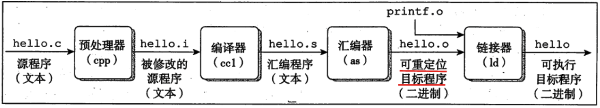

# 函数的调用堆栈详细过程



+ 预处理：进行头文件和宏定义的替换
+ 编译：由编译器把高级语言代码编译为汇编代码
+ 汇编：由汇编器把汇编代码翻译成二进制代码, 也即是 .o 文件
+ 链接：由链接器把多个 .o 文件链接成可执行文件; 可分为编译时链接、加载时链接 (程序被加载到内存中执行时) 、运行时链接 (由应用程序执行时) 

```c++
// test.cpp
int sum(int a, int b) {
    int temp = 0;
    temp = a + b;
    return temp;
}

int main() {
    int a = 10;
    int b = 20;
    
    in ret = sum(a, b);
    
    return 0;
}
```

【问题】：

+ main 函数调用 sum, sum 执行完以后, 怎么知道回到哪个函数中？
+ sum 函数执行完, 回到 main 以后, 怎么知道从哪一行指令继续运行的？


函数运行时, 在栈帧上开辟空间,  esp 栈顶地址 (低地址) , ebp 栈底地址 (高地址) 

```angular
                                  【低地址】
┌────────────────────────────────┐ 2️⃣ esp sum 函数开辟栈帧空间
│                                │
│                                │
│            0xCCCCCCCC          │
│                                │
│                                │
├────────────────────────────────┤
│             temp 0             │
├────────────────────────────────┤ 2️⃣ ebp 
│            0x0018ff40          │
├────────────────────────────────┤    sum 函数栈帧
│            0x08124458          │
├────────────────────────────────┤ 
│           10 -> int a          │
├────────────────────────────────┤ 
│           20 -> int b          │
├────────────────────────────────┤ 1️⃣ esp
│                                │
│                                │
│                                │
├────────────────────────────────┤
│               ret              │
├────────────────────────────────┤
│              b  10             │
├────────────────────────────────┤
│              a  10             │
└────────────────────────────────┘ 1️⃣ ebp 3️⃣ ebp, 0x0018ff40 main 函数的栈帧
                                 【高地址】
```


```assembly
sum:
    # 下面三行对应于 { 
	push ebp  # 栈底地址入栈
    mov ebp, esp  # esp 存放的是 main 栈帧的栈顶
                  # 执行该句后 ebp 存放的即 main 栈帧的栈顶，为 sum 栈帧的栈底
    sub esp, 4Ch  # 给 sum 函数开辟栈帧空间
    
    # windows 编译器 for 循环 【对栈帧初始化 0xCCCCCCCCh】 -858993460
    
    mov dword ptr[ebp-4], 0      # int temp = 0
    mov eax, dword ptr[ebp+0Ch]  # a + b
    add eax, dword ptr[ebp+8]
    mov dword ptr[ebp-4], eax    # temp = a + b
    mov eax, dword ptr[ebp-4]
 
 	# 下面三行对应于 }
 	mov esp, ebp  # 回退栈帧, sum 函数开辟栈帧空间归还给系统, 【未对栈空间进行清理】
 	pop ebp       # 出栈元素的值赋给 ebp, 回到 main 函数栈底
 	ret           # 出栈操作; 把出栈的内容, 放入 CPU 的 PC(program counter) 寄存器里面
 	              # CPU 的 PC 寄存器存放的是下一行要执行指令的地址
 
main:    
    mov dword ptr[ebp-4], 0Ah  # int a = 10
    mov dword ptr[ebp-8], 14h  # int b = 20

    mov eax, dword ptr[ebp-8]  # int ret = sum(a, b)
    push eax                   # 调用函数, 先向栈压参数, 从右向左压
    mov eax, dword ptr[ebp-4]
    push eax 

    call sum                     # 将下一行指令的地址压栈
    add esp, 8                   # 指令地址 0x08124458, 形参变量 a, b 内存交还给系统
    mov dword ptr[ebp-oCh], eax  # eax 存储 sum 函数中的temp, ptr[ebp-oCh] 为 ret 
```

【说明】：避免下面写法

```c++
int* func() {
    int data = 10;
    return &data;
}

int *p = func();
// func2();  可能会修改 func 开辟的栈内容
cout << *p << endl;  // 不安全, 非法访问内存
```


```bash
chang@C:~/test$ g++ -S test.cpp  # 生成汇编程序
chang@C:~/test$ ls
test.cpp  test.s
chang@C:~/test$ cat test.s
# ELF 部分
        .file   "test.cpp"
        .text
        .globl  _Z3sumii
        .type   _Z3sumii, @function
        
# sum 函数开始
_Z3sumii:
.LFB0:
        .cfi_startproc
        endbr64
        pushq   %rbp
        .cfi_def_cfa_offset 16
        .cfi_offset 6, -16
        movq    %rsp, %rbp
        .cfi_def_cfa_register 6
        movl    %edi, -20(%rbp)
        movl    %esi, -24(%rbp)
        movl    $0, -4(%rbp)
        movl    -20(%rbp), %edx
        movl    -24(%rbp), %eax
        addl    %edx, %eax
        movl    %eax, -4(%rbp)
        movl    -4(%rbp), %eax
        popq    %rbp
        .cfi_def_cfa 7, 8
        ret
        .cfi_endproc
.LFE0:
        .size   _Z3sumii, .-_Z3sumii
        .globl  main
        .type   main, @function
        
# main 函数开始   
main:
.LFB1:
        .cfi_startproc
        endbr64
        pushq   %rbp
        .cfi_def_cfa_offset 16
        .cfi_offset 6, -16
        movq    %rsp, %rbp
        .cfi_def_cfa_register 6
        subq    $16, %rsp
        movl    $10, -12(%rbp)
        movl    $20, -8(%rbp)
        movl    -8(%rbp), %edx
        movl    -12(%rbp), %eax
        movl    %edx, %esi
        movl    %eax, %edi
        call    _Z3sumii
        movl    %eax, -4(%rbp)
        movl    $0, %eax
        leave
        .cfi_def_cfa 7, 8
        ret
        .cfi_endproc
.LFE1:
        .size   main, .-main
        .ident  "GCC: (Ubuntu 11.2.0-19ubuntu1) 11.2.0"
        .section        .note.GNU-stack,"",@progbits
        .section        .note.gnu.property,"a"
        .align 8
        .long   1f - 0f
        .long   4f - 1f
        .long   5
0:
        .string "GNU"
1:
        .align 8
        .long   0xc0000002
        .long   3f - 2f
2:
        .long   0x3
3:
        .align 8
4:
```